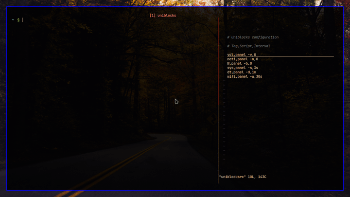

# Uniblocks: Universal updatable status bar modules generator




## Features

-  The modules can be used with any status bar application
-  Updating is possible both periodically and manually
-  Runs as fast as it gets. (hint: POSIX compliant shellscript)

## Dependencies

-  sed, grep, pgrep, xargs, cat, mkfifo

## Installation

```sh
git clone https://github.com/salman-abedin/uniblocks.git && cd uniblocks && sudo make install
```

## Usage

-  Create a **~/.config/uniblocksrc** file for configuring the modules.
   Here is an [examples](https://github.com/salman-abedin/uniblocks/blob/master/example_config)

-  run `uniblocks --gen,-g` to generate the status string

   -  Modules are printed according to the order in the **config**

-  run `uniblocks --update,-u <TAG>` to manually update individual modules

## Uninstallation

```sh
sudo make uninstall
```

---

## Repos you might be interested in

[Alfred/panel.sh](https://github.com/salman-abedin/alfred/blob/master/panel.sh)
: The status bar modules

[Bolt](https://github.com/salman-abedin/bolt)
: The lightning fast workflow creator

[Crystal](https://github.com/salman-abedin/crystal)
: The transparent setup

[Magpie](https://github.com/salman-abedin/magpie)
: The dotfiles

[Alfred](https://github.com/salman-abedin/alfred)
: The scripts

[Devour](https://github.com/salman-abedin/devour)
: Terminal swallowing

## Contact

SalmanAbedin@disroot.org
